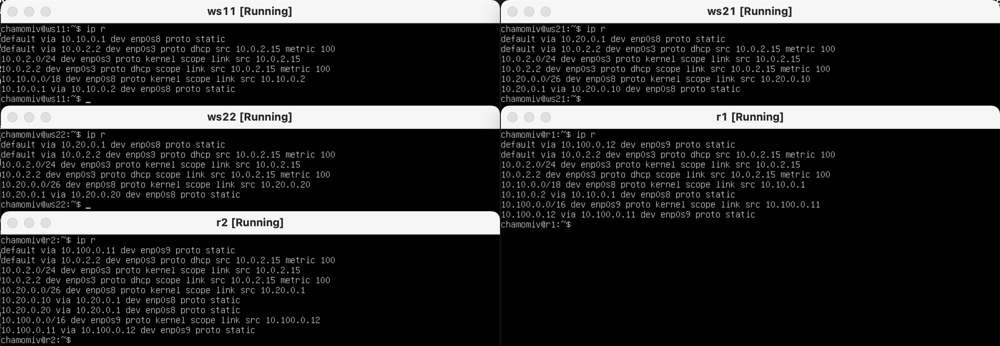
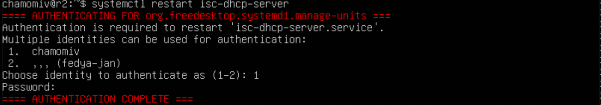
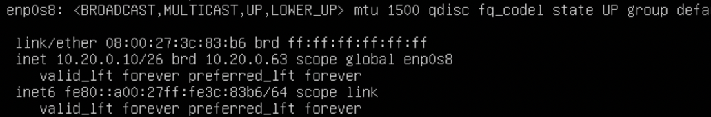

## Part 1. Инструмент ipcalc 
1. Сети и маски 
    * Устанавливаем **ipcalc** командой `sudo apt install ipcalc` 

    1) Адрес сети **192.167.38.54/13** `ipcalc 192.167.38.54/13` 
    *Адрес сети*  
    2) Перевод маски **255.255.255.0** в префиксную и двоичную запись `ipcalc 255.255.255.0` 
    *Префиксная и двоичная запись*  
    * **/15** в обычную и двоичную `ipcalc /15` 
    *Обычная и двоичная запись*  
    * **11111111.11111111.11111111.11110000** перевел в десятичный вид и выполнил в обычную и префиксную `ipcalc 255.255.255.240` 
    *Обычная и префиксная запись*  
    3) Минимальный и максимальный хост в сети **12.167.38.4** при масках: 
    * **/8** `ipcalc 12.167.38.4 /8` 
    *HostMin & HostMax  
    * **11111111.11111111.00000000.00000000** `ipcalc 12.167.38.4 11111111.11111111.00000000.00000000` 
    *HostMin & HostMax*  
    * **255.255.254.0** `ipcalc 12.167.38.4 255.255.254.0` 
    *HostMin & HostMax  
    * **/4** `ipcalc 12.167.38.4 /4` 
    *HostMin & HostMax  
     
2. localhost 
    * По адресам **194.34.23.100** && **128.0.0.1** обратиться к приложению не получится, потому что у них нет петли. 
    * У **127.0.0.2** && **127.1.0.1** есть **loopback**, так что к ним обратиться можно. 
    *127.0.0.2  
    *127.1.0.1  
     
3.  Диапазоны и сегменты сетей 
    1.  
    * **10.0.0.45** - Частный `ipcalc 10.0.0.45` 
    *Private*  
    * **134.43.0.2** - Публичный `ipcalc 134.43.0.2` 
    *Public*  
    * **192.168.4.2** - Частный `ipcalc 192.168.4.2` 
    *Private*  
    * **172.20.250.4** - Частный `ipcalc 172.20.250.4` 
    *Private*  
    * **172.0.2.1** - Публичный `ipcalc 172.0.2.1` 
    *Public*  
    * **192.172.0.1** - Публичный `ipcalc 192.172.0.1` 
    *Public*  
    * **172.68.0.2** - Публичный `ipcalc 172.68.0.2` 
    *Public*  
    * **172.16.255.255** - Частный `ipcalc 172.16.255.255` 
    *Private*  
    * **10.10.10.10** - Частный `ipcalc 10.10.10.10` 
    *Private*  
    * **192.169.168.1** - Публичный `ipcalc 192.169.168.1` 
    *Public*  

    2.  
        * **10.10.0.2** - да. 
        * **10.10.10.10** - да. 
        * **10.10.1.255** - да. 

## Part 2. Статическая маршрутизация между двумя машинами 
1.  
    * Поднимаем две виртуальные машины **ws1** && **ws2** 
* `ip a` 
    *ip a*  
    * **ws1 && ws2** `sudo nano etc/netplan/00-installer-config.yaml` 
    *ws1 && ws2*  
    * Выполняем команды `sudo netplan apply` && `ip a` 
    * **ws1 && ws2** 
    *ws1 && ws2*  
     

2. Добавление статического маршрута вручную 
    * Добавление статического маршрута от одной машины до другой и обратно при помощи команды `ip r add` 
    * **ws1** - `ip r add 172.24.116.8 dev enp0s8` 

    * **ws2** - `ip r add 192.168.100.10 dev enp0s8` 
    * Пропинговать соединение между машинами: 
    * **ws1** 
    *ws1 && ws2*  
    * Добавление статического маршрута с сохранением 
    * `sudo nano /etc/netplan/00-installer-config.yaml` 
    *ws1 && ws 2*  
    * `sudo netplan apply` 
    * `sudo reboot` 
     
    * Пропинговать соединение между машинами 
    * **ws1** - `ping 192.168.100.10` 
    * **ws2** - `ping 172.24.116.8` 
    *ws1 && ws2*  
     
## Part 3. Утилита iperf3 
1. Перевести и записать в отчёт: 
    * 8 Mbps = 1 MS/s. 
    * 100 MB.s = 100000 Kbps. 
    * 1 Gbps = 1000 Mbps. 
     
2. Утилита **iperf3** 
    * **ws1** - `iperf3 -s` 
    * **ws2** - `iperf3 -c 192.168.100.10 -p 5201` 
    *ws1 && ws2*  
     
## Part 4. Сетевой экран 
1. Утилита **iptables** 
    * Устанавливаем **iptables** `sudo apt-get install iptables` 
    * на **ws1** применить стратегию когда в начале пишется запрещающее правило, а в конце пишется разрешающее правило (это касается пунктов 4 и 5) 
    * открыть на машинах доступ для порта **22** (ssh) и порта **80** (http) 
    * **запретить** echo reply (машина не должна "пинговаться”, т.е. должна быть блокировка на OUTPUT) 
    * **разрешить** echo reply (машина должна "пинговаться") 
    * на **ws2** применить стратегию когда в начале пишется разрешающее правило, а в конце пишется запрещающее правило (это касается пунктов 4 и 5) 
     
    * **разрешить** echo reply (машина должна "пинговаться") 
    * **запретить** echo reply (машина не должна "пинговаться”, т.е. должна быть блокировка на OUTPUT) 
    * открыть на машинах доступ для порта **22** (ssh) и порта **80** (http)
    *ws1 && ws 2*  
     
    * Запустить файлы на обеих машинах командами `sudo chmod +x /etc/firewall.sh` && `sudo sh /etc/firewall.sh` 
    *ws1 && ws2*  
     
    * **ws1** - INPUT для пакетов на ping-reply DROP - не работает т.е. пакеты отправляет, но не принемает. 
    *ws1*  
    * **ws2** - INPUT для пакетов на ping-reply ACCEPT - работает. 
    *ws2*  
     
2. Утилита **nmap** 
    * Устанавливаем **nmap** `sudo apt-get install nmap` 
    *ws1*  
     
## Part 5. Статическая маршрутизация сети 
1. Настройка адресов машин 
    * Настроить конфигурации машин в `etc/netplan/00-installer-config.yaml` 
    *ws11 && ws21 && ws22 && r1 && r2*  
     
    * Перезапустить сервис сети. Если ошибок нет, то командой `ip -4 a` проверить, что адрес машины задан верно. 
    *ws11 && ws21*  
    *ws22 && r1 && r2*  
     
    * Также пропинговать **ws22** && **ws21**. Аналогично пропинговать **r1** && **ws11**.
    *ws22 && ws21*  
    *ws11 && r1*  
     

2. Включение переадресации IP-адресов 
    * Для включения переадресации IP, выполните команду на роутерах: `sudo sysctl -w net.ipv4.ip_forward=1` 
    *r1 && r2*  
    * Откройте файл `/etc/sysctl.conf` и добавьте в него следующую строку: `net.ipv4.ip_forward = 1` 
    *r1 && r2*  
     
3. Установка маршрута по-умолчанию 
    * Настроить маршрут по-умолчанию (шлюз) для рабочих станций. Для этого добавить **gateway4** [ip роутера] в файле конфигураций 
    *ws11 && ws21 && ws22 && r1 && r2*  
     
    * Вызвать `ip r` и показать, что добавился маршрут в таблицу маршрутизации 
    *ws11 && ws21 && ws22 && r1 && r2*  
     
    * Пропинговать с **ws11** роутер **r2** и показать на **r2**, что пинг доходит. Для этого использовать команду: `tcpdump -tn -i eth1` 
    *ws11 && r2*  
     
4. Добавление статических маршрутов 
    * Добавить в роутеры **r1** && **r2** статические маршруты в файле конфигураций. 
    *r1 && r2*  
    * Вызвать `ip r` и показать таблицы с маршрутами на обоих роутерах. 
    *r1 && r2*  
    * Запустить команды на **ws11**: `ip r list 10.10.0.0/18`  
    
    `ip r list 0.0.0.0/0`
    *ws11*  
    * В отчете выбран путь отличный от **10.10.0.0** - этот адрес указывает на все адреса. 
     
5. Построение списка маршрутизаторов 
    * Запустить на **r1** команду дампа: `tcpdump -tnv -i enp0s8` 
    *r1*  
    * При помощи утилиты `traceroute` построить список маршрутизаторов на пути от **ws11** до **ws21** `traceroute 10.20.0.10` 
    *ws11*  
    * Путь строится от узла к узлу до того момента, пока не будет достигнута конечная точка. Каждый пакет проходит на своем пути определенное количество узлов, пока не достигнет своей цели. На каждом узле добавляется счетчик, который отслеживает количество пройденых узлов. 
     
6. Использование протокола **ICMP** при маршрутизации 
    * Запустить на **r1** перехват сетевого трафика, проходящего через **enp0s8** с помощью команды: 
    * Пропинговать с **ws11** несуществующий **IP** (например, **10.30.0.111**) с помощью команды: `ping -c 1 10.30.0.111` 
    *ws11*  
     
## Part 6. Динамическая настройка IP с помощью DHCP 
1. Для **r2** настроить в файле `/etc/dhcp/dhcpd.conf` конфигурацию службы **DHCP**: 
    * указать адрес маршрутизатора по-умолчанию, DNS-сервер и адрес внутренней сети. 
    *r2*  
     
2.  * в файле `/etc/resolv.conf` прописать `nameserver 8.8.8.8.` 
    *r2*  
    * Перезагрузить службу **DHCP** командой `systemctl restart isc-dhcp-server` 
    *r2*  
    * Машину **ws21** перезагрузить при помощи `sudo reboot` и через `ip a` показать, что она получила адрес. 
    *ws21*  
    * Также пропинговать **ws22** && **ws21**. 
    *ws22 && ws21*  
    * Указать MAC адрес у **ws11**, для этого в `etc/netplan/00-installer-config.yaml` надо добавить строки: **macaddress: 10:10:10:10:10:BA**, **dhcp4: true** 
    *ws11*  
    * Для **r1** настроить аналогично **r2**, но сделать выдачу адресов с жесткой привязкой к **MAC-адресу (ws11)**. Провести аналогичные тесты. 
    *r1*   
    * Перезагрузить службу **DHCP** командой `systemctl restart isc-dhcp-server` 
    *r1*  
    * Машину **ws11** перезагрузить при помощи `sudo reboot` и через `ip a` показать, что она получила адрес. 
    *ws11*  
     
3. Запросить с ws21 обновление ip адреса 
    * В отчёте поместить скрины ip до и после обновления. 
    *ws21*  
    *ws21*  
    * В отчёте описать, какими опциями DHCP сервера пользовались в данном пункте. 
    * **dhclient -r** && **dhclient -v** 

## Part 7. NAT 
1. В файле `/etc/apache2/ports.conf` на **ws22** && **r1** изменить строку **Listen 80** на **Listen 0.0.0.0:80**, то есть сделать сервер **Apache2** общедоступным 
    *ws22 && r1*  
    * Запустить веб-сервер **Apache** командой `service apache2 start` на **ws22** && **r1** 
    * Добавить в фаервол, созданный по аналогии с фаерволом из **Части 4**, на **r2** следующие правила: 
    1) Удаление правил в таблице **filter** - `iptables -F` 
    2) Удаление правил в таблице **NAT** - `iptables -F -t nat` 
    3) Отбрасывать все маршрутизируемые пакеты - `iptables --policy FORWARD DROP` 
    *r2*  
    * Запускать файл также, как в **Части 4.** 
    * Проверить соединение между **ws22** && **r1** командой `ping` 
    * При запуске файла с этими правилами, **ws22 не должна** "пинговаться" с **r1** 
    *ws22*  
    * Добавить в файл ещё одно правило: 
    4) Разрешить маршрутизацию всех пакетов протокола **ICMP** 
    *r1*  
    * Проверить соединение между **ws22** && **r1** командой `ping` 
    * При запуске файла с этими правилами, **ws22 должна** "пинговаться" с **r1** 
    *r2*  
    * Добавить в файл ещё два правила: 
    5) Включить **SNAT**, а именно маскирование всех локальных **ip** из локальной сети, находящейся за **r2** (по обозначениям из **Части 5** - **сеть 10.20.0.0**) 
    6) Включить **DNAT** на **8080 порт** машины **r2** и добавить к веб-серверу **Apache**, запущенному на **ws22**, доступ извне сети 
    
    *r2*  
    * Запускать файл также, как в **Части 4** 
    * Проверить соединение по TCP для SNAT, для этого с ws22 подключиться к серверу Apache на r1 командой: `telnet`
    *ws22*  
    * Проверить соединение по **TCP** для **DNAT**, для этого с **r1** подключиться к серверу **Apache** на **ws22** командой `telnet` (обращаться по адресу **r2** и порту **8080**) 
    *r1*  

## Part 8. Дополнительно. Знакомство с SSH Tunnels 
1. Запустить веб-сервер Apache на ws22 только на localhost (то есть не изменять файл /etc/apache2/ports.conf или, если был изменен ранее, вернуть строку Listen 80) 
*ws22*  
    * Раскомментировал `port 22` && `AllowTcpForwarding` в `/etc/ssh/sshd_config`
    
    *ws22*  
    * Воспользоваться Local TCP forwarding с ws21 до ws22, чтобы получить доступ к веб-серверу на ws22 с ws21 
    *ws22*  
    * Воспользоваться Remote TCP forwarding c ws11 до ws22, чтобы получить доступ к веб-серверу на ws22 с ws11 
    *ws22*  
    * Для проверки, сработало ли подключение в обоих предыдущих пунктах, перейдите во второй терминал (например, клавишами Alt + F2) и выполните команду: `telnet 127.0.0.1 [локальный порт]` 
    *ws11*  
    *ws21*  
    *ws22*  